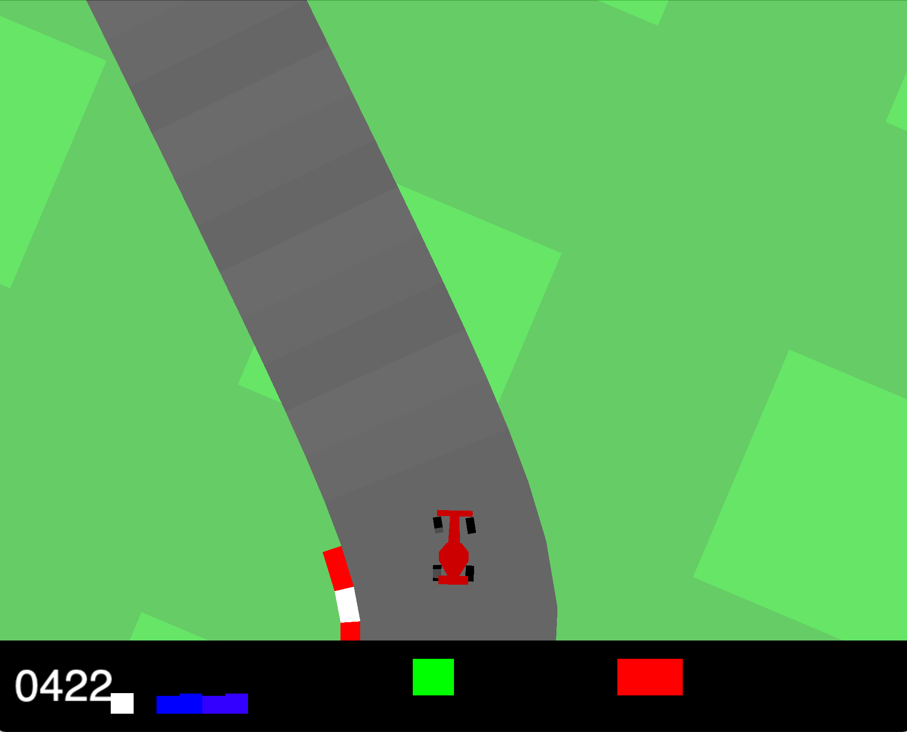

# Overview
This repository contains code for various reinforcement learning algorithms such as DQN, Double DQN and DDPG. Click on each of their sub-folders to find out specific information on how they each work. See below for an overview on the project results.

## Click Image Below For YouTube Video!
[](https://www.youtube.com/watch?v=eQtx2ZZtuTw)


# Testing Results
| Method                                                                                            | Average Reward (across 50 runs) | Max  | Min  | Standard Deviation |
|---------------------------------------------------------------------------------------------------|---------------------------------|------|------|--------------------|
| Random Agent                                                                                      |             -24.28              | -2.49|-30.09|        7.13        | 
| Human                                                                                             |             770.75              |824.09|683.29|       45.28        | 
| Proportional, Integral, Derivative (PID) Control                                                  |             680.98              |805.45|446.62|       90.22        | 
| DQN with Experience Replay and Fixed Target Network                                               |             385.06              |841.28| 43.28|       251.37       | 
| Prioritised Double DQN with Experience Replay, Fixed Target Network and Reward Clipping           |             730.88              |870.65|101.22|       216.13       | 
| Prioritised Double DQN with Experience Replay, Fixed Target Network and Reward Clipping*          |             899.49              |919.69|817.27|        98.25       |
| DDPG                                                                                              |             253.12              |507.64| 78.65|       231.93       | 
| DDPG Reward Clipping                                                                              |             620.60              |835.48|187.61|       197.00       | 

*An extra dense layer to the neural network and modified episode termination approach.


*One dense layer more and more _"lenient episode termination"_ (meaning the car can drive on the grass for longer before terminating episode)


# Building Conda Env on Local Machine
A yml script has been created to help with building your anaconda environment. Simply run the command below in terminal (which supports anaconda). Environment name can be changed from SERVER_ENV to user choice inside yml file.
```shell
conda env create --file build_conda_env.yml
```

# Server Setup

## In Code (the model to train)
Tensorflow, by default, hogs/ allocates all the GPU memory. This is *NOT* good as this often leads to *Out of Memory* errors during training. In order to prevent this, add the following lines of code at the *TOP* of your script. Essentially, this will enforce that Tensorflow only allocates as much memory as is needed at that given time.
```python
# Prevent tensorflow from allocating the all of GPU memory
gpus = tf.config.experimental.list_physical_devices('GPU')
for gpu in gpus:
    tf.config.experimental.set_memory_growth(gpu, True)   # set 
```

Open AI Gym uses pyglet which requires a screen/ monitor to function. The servers don't have said screens so we make virtual ones within our code to spoof the code into thinking we do. See below:
```python
import pyvirtualdisplay

# Creates a virtual display for OpenAI gym
pyvirtualdisplay.Display(visible=0, size=(1400, 900)).start()
```

While training our model, it is good practice to save it periodically so that training can be continued if the process is interrupted before completion. Add these lines and modify the arguments as necessary.
```python
# Where are models saved? How frequently e.g. every x1 episode?
USERNAME                = "username"
MODEL_TYPE              = "DQN"
TIMESTAMP               = datetime.datetime.now().strftime("%Y%m%d-%H%M%S")
SAVE_TRAINING_FREQUENCY = 1
model_dir = f"./model/{USERNAME}/{MODEL_TYPE}/{TIMESTAMP}/"

...

    # should have this function in the Agent Class
    def save(self, name):
        """Save model to appropriate dir, defined at start of code."""
        if not os.path.exists(model_dir):
             os.makedirs(model_dir)
        self.model.save_weights(model_dir + name)

...

    # Put this in the training loop
    if episodeNum % SAVE_TRAINING_FREQUENCY == 0:
        agent.save(f"episode_{episodeNum}.h5")
```

To use Tensorboard, we need to create the appropriate **logs/fit** event data in the expected format. Add the first two lines at the top of your code and then add the callbacks line into the model.fit function.
```python
# Setup TensorBoard model
log_dir = "logs/fit/" + datetime.datetime.now().strftime("%Y%m%d-%H%M%S")
tensorboard_callback = tf.keras.callbacks.TensorBoard(log_dir=log_dir, histogram_freq=1)

...

self.model.fit(state,action_vals,epochs=1,verbose=0, callbacks=[tensorboard_callback])  # note TensorBoard callback!
```

*NOTE: For examples of the implementation, look at the [DQN.py](DQN.py) and [tensorboard_test.py](tensorboard_test.py)*

## In Terminal (Connecting to Server)
Login to the servers using your own credentials. If at any point you need help, go to [HEX](https://hex.cs.bath.ac.uk/) for support, it's a great source but you need to be a University of Bath student to access it!
```text
<!-- login to server as normal via terminal-->
ssh username@location
```

Only need to do this the first time... We build the Docker container because the server GPUs won't work without it.
```text
<!-- build docker container if not already present -->
hare build -t oah33/docker_rl .
```

Now go to the ```boot.sh``` shell script and update it to ensure you will be running the correct script. See the */code/<FILENAME.PY>* section at the bottom as shown here.
```shell
# run training AND tensorboard at same time
# IMPORTANT! Change /code/<FILENAME.PY> to run your chosen script!
python3 /code/DQN.py & tensorboard --logdir logs/fit --port=80 --host=0.0.0.0
```

Run the Docker container and pass back the relevant information to the server/ host.
```text
<!-- run docker container with python script -->
hare run --name oah33_cntr -p 10000:80 --gpus device=0 --rm -v "$(pwd)":/code oah33/docker_rl
```
A lot to unpack in this command, lets break it down:
* ```hare run```: Use docker to run the following inside a virtual machine.
* ```--name oah33_cntr```: call the container something descriptive and type-able.
* ```-p 10000:80```: Connect the Docker container port 80 to server host port 10000.
* ```--gpus device=0```: Access GPU number 0 specifically (see Hex for more info on GPU selection).
* ```--rm```: Clean up after the container finishes.
* ```-v "$(pwd)":/app - $(pwd)```: $(pwd) is the directory you are currently in (pwd = print working directory), so it is mounting your current directory in the folder /app inside the container.

In a new terminal, connect with the server and daisy chain the ports from the Docker container (80) to the server (10000) and then to localhost/ your machine (8080). This way, you can access the information being generated through your web browser.
```text
<!-- in new terminal, connect to port from server to localhost -->
ssh -L 8080:localhost:10000 username@location
```

## On Host Machine
Navigate into a browser and paste the following command. If everything has worked properly, you should now see the TensorBoard page in said browser.
```text
<!-- paste the below into a browser to access TensorBoard results -->
localhost:8080
```


## Debugging Server Stuff
```text
jupyter notebook --no-browser --port=10000

tensorboard --logdir logs/fit --port=10000

hare run -p 10000:80 --rm -v "$(pwd)":/code oah33/docker_rl jupyter notebook --allow-root --no-browser --port=80 --ip=0.0.0.0

tensorboard --logdir logs/fit --port 6006

hare me

hare attach <container name>

hare exec <container name> tensorboard --logdir logs/fit --port=80 --host=0.0.0.0

hare run -p 10000:80 --gpus device=0 --rm -v "$(pwd)":/code oah33/docker_rl
hare exec agitated_elion python3 /code/tensorboard_test.py

nvidia-smi
```

# Notes
1) To select interpreter in VS Code--> cmd+shift+p, Python. Select Interpreter, CHOOSE PREFERENCE
2) To select interpreter in PyCharm: Open Settings (Ctrl+Alt+S) -> Project: <project_name> -> Python Interpreter
